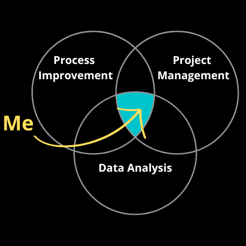

<h1 align="center">Hi 👋, I'm Daniel</h1>
<h3 align="center">A passionate data scientist, project manager and process improvement enthusiast from Brazil</h3>

<h2 align="left">About me</h2>

###

✨ Working with **data, technology and in project environments since 2003**. 

📚 Post graduate **Data Scientist**, Lean Six Sigma **Black Belt**, **Project Management Professional** (PMP), **Bachelor in Business Administration**. 

🛠 **Been around the block**: Worked in many different sectors, such as Retail, Telecom, IT, Manufacturing, Agriculture, Construction, Real State, Consultancy and Energy, among others.  

🎯 Goals: Discover valuable **insights using data science** and technology in **project environments to improve business processes**. 

💻 Passionate about **technology and data**, fast learner and energetic. 

🤝**I love a good challenge** as well as the opportunity to learn and help others.

###

🔭 I’m currently working on **a clustering project to manage over 5.000 SKUs with over 200 features each from 10 different factories.**

🌱 I’m currently learning **neural networks, AI automations and advanced data visualization.**

👯 I’m looking to collaborate on **Machine Learning, AI and automation projects.**

👨‍💻 All of my projects are available at <a href="https://github.com/realdanizilla?tab=repositories">My Portfolio.</a>

📝 I write articles on <a href="https://www.linkedin.com/in/daniel-ribeiro-pmp-a018a413/recent-activity/all/">LinkedIn.</a>

💬 Ask me about **business analytics, data extraction, manipulation, modelling and visualization, process improvement and project management.**

📄 Know about my experiences <a href="https://www.linkedin.com/in/daniel-ribeiro-pmp-a018a413/">here.</a>

⚡ Fun fact about me: I try to always be on the sweet spot below:

⚡ Another fun fact about me: my nickname comes from me having big feet since I was a teenager (size 13 US, 47 EU, 12 UK) and the release of movie Godzilla (1998).

###

<h2 align="left">Tech Stack</h2>

Python, Jupyter, Pandas, Numpy, Scikit-Learn, Matplotlib, Seaborn, PyTorch, TensorFlow, Streamlit, Beautiful Soup, Spacy, NLTK, Transformers, Keras, PowerBI, Power Automate, Power Apps, Excel, Minitab, VSCode, MySQL, SQL Server, Anaconda, CSS, HTML. 

  
  
  
  
  
  
  
  
  
  
  
  
  
  
  
  
  
  
  
  
  
  
  
  
  
  
  
  
  
  
  
  
  
  
  
  
  
  
  
  
  

###

<h2 align="left">Contact me</h2>

###

  
  
  

###

<h2 align="left">My Projects</h2>

| Project Name                    | Short Description                                                                    | Link to Project                                                 | Programming Languages         |
|---------------------------------|--------------------------------------------------------------------------------------|-----------------------------------------------------------------|------------------------------|
| Rusty Bargain App                   | CRUD for vehicle data and ML for vehicle price prediction   | [Rusty Bargain App](https://github.com/realdanizilla/Rusty-Bargain-App)       | Python, PostgreSQL, Pydantic, FastAPI, Streamlit, SQLAlchemy, CatBoost, Docker          |
| Data Science Project Assistant                   | Automates the creation of a data science tutorial with machine learning using AI Agents, Serper API and OpenAI.  | [DS Project Assistant](https://github.com/realdanizilla/CrewAI_Agents)       | Python, CrewAI, Open_AI API, Serper API          |
| COVID19-LATAM                   | Analysis of COVID-19 vaccination in Latin America to assess its impact on case numbers and deaths.  | [COVID-19 Latam](https://github.com/realdanizilla/COVID19-LATAM)       | SQL, Tableau, Python          |
| Interconnect                    | Predicts customer churn for a telecom company by analyzing user contracts and services.             | [Interconnect](https://github.com/realdanizilla/Interconnect)        | Python, pandas, scikit-learn, numpy, matplotlib, seaborn, LightGBM, CatBoost, XGBoost  |
| Junky-Union                     | Sentiment analysis project to classify movie reviews as positive or negative.                       | [Junky-Union](https://github.com/realdanizilla/Junky-Union)         | Python, NLTK, spacy, BERT, scikit-learn, numpy, matplotlib, seaborn, math, LightGBM, CatBoost, XGBoost    |
| Drone-Delivery                     |  Drone delivery route optimization by analyzing city coordinates and shipment volumes. Identifies the best location for a warehouse.                       | [Drone-Delivery](https://github.com/realdanizilla/Drone-Delivery)         | Python, pandas, vector calculations    |
| Loyalty-Savings                     |  A predictive model to estimate additional profits from two loyalty programs at a major retailer.                       | [Loyalty-Savings](https://github.com/realdanizilla/Loyalty-Savings)         | Data Analysis, Excel, Regression    |
| MNSC                     |  A model to analyze and track the profitability of contracts at a law firm.                       | [MNSC](https://github.com/realdanizilla/MNSC)         | Business Analytics, Excel, Data Modelling, Dashboards    |
| Crazy-Taxi                      | Predicting taxi demand during rush hours using time series analysis.                                 | [Crazy-Taxi](https://github.com/realdanizilla/Crazy-Taxi)          | Python, pandas, scikit-learn, numpy, motplotlib, LightGBM, CatBoost, XGBoost   |
| Rusty-Bargain                   | Predicting the market value of used cars using different machine learning models.                   | [Rusty-Bargain](https://github.com/realdanizilla/Rusty-Bargain)       | Python, pandas, scikit-learn, numpy, matplotlib, seaborn, math, time, LightGBM, CatBoost, XGBoost     |
| Insurance                       | Predicting the number of insurance claims and identifying potential risks.                          | [Insurance](https://github.com/realdanizilla/Insurance)           | Python, pandas, scikit-learn, numpy, seaborn, K-Neighbours  |
| Oily-Giant                      | Analyzing the best locations for oil well development based on potential profit margins.            | [Oily Giant](https://github.com/realdanizilla/Oily-Giant)          | Python, pandas, scikit-learn, numpy, matplotlib, scipy  |
| Beta-Bank                       | Predicting customer churn to improve retention strategies for a financial institution.              | [Beta-Bank](https://github.com/realdanizilla/Beta-Bank)           | Python, pandas, scikit-learn, matplotlib  |
| Megaline-Classification         | Classifying users into appropriate plans based on usage patterns for a telecom provider.            | [Megaline Classification](https://github.com/realdanizilla/Megaline-Classification) | Python, pandas, scikit-learn |
| Zuber                           | Data analysis on ride-sharing service trends and competitor evaluation.                             | [Zuber](https://github.com/realdanizilla/Zuber)               | Python, pandas, numpy, Beautiful Soup, matplotlib, scipy                |
| Videogames                      | Market analysis of video game platforms and genres for business insights.                           | [Videogames](https://github.com/realdanizilla/Videogames)          | Python, pandas, numpy, matplotlib, seaborn, scipy                |
| Vehicles                        | Predictive model for vehicle data to analyze various attributes and their impact on price.         | [Vehicles](https://github.com/realdanizilla/vehicles)            | Python, pandas, scikit-learn, plotly express, streamlit  |
| Megaline                        | Analysis of telecom user behavior to improve product offerings and customer segmentation.          | [Megaline](https://github.com/realdanizilla/Megaline)            | Python, pandas, scikit-learn, numpy, math  |
| Instacart                       | Analyzing grocery shopping patterns to optimize product placements and marketing strategies.       | [Instacart](https://github.com/realdanizilla/Instacart)           | Python, pandas, numpy, matplotlib                |

